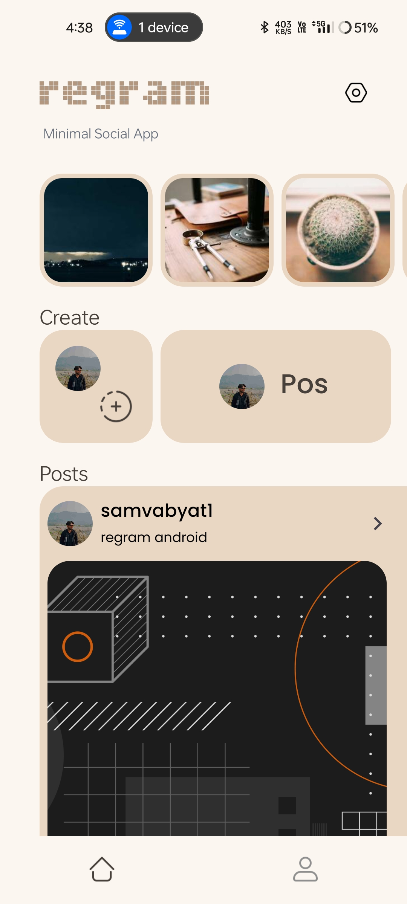
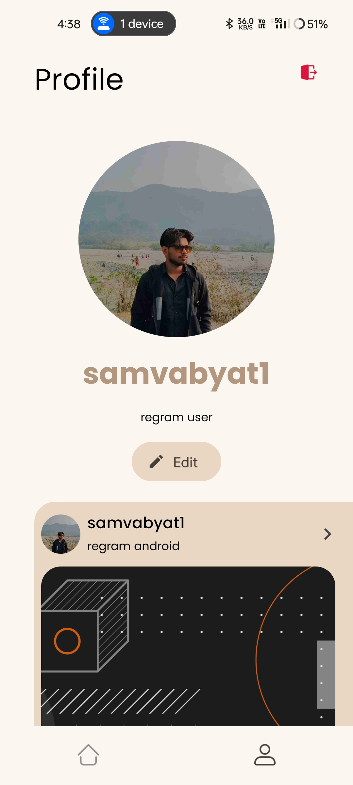
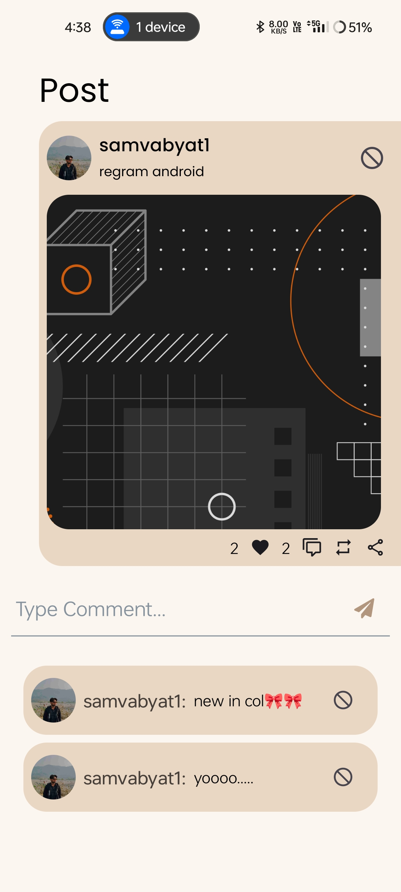
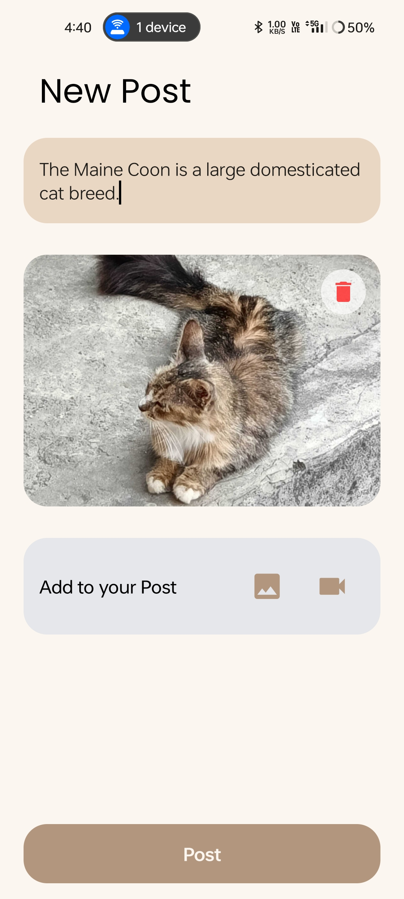

    
    <h1>regram</h1>
    
Social media app in Expo React Native + Supabase

---

  
  

  
  

## Features
- Upload images and videos as posts
- Like and comment on posts
- Follow and unfollow users
- Search for users
- View user profiles
- View posts from followed users
- View stories from followed users

## Installation

## Tech Stack

**Client:** Flutter, Android, Web, Ios

**Backend:**  Supabase (Postgresql, Storage, Auth)
